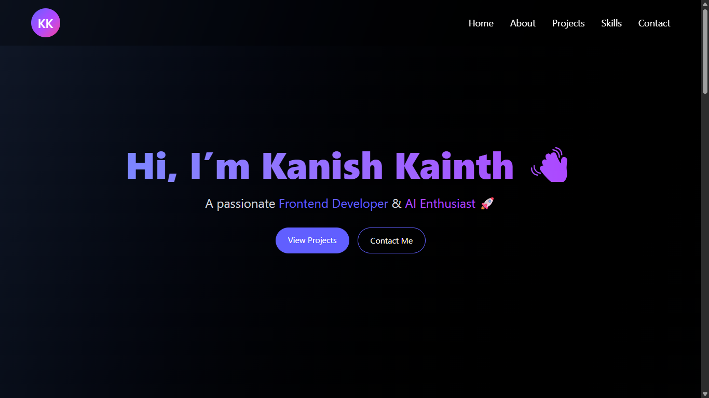

# 🌟 My Portfolio Website  

Welcome to my personal portfolio website!  
This project is a modern, responsive portfolio built using **React + TailwindCSS**.  
It showcases my skills, projects, and experiences as a **Frontend Developer & AI Enthusiast**.   

---

## 🚀 Features 
- 📱 Fully responsive design (desktop, tablet, mobile)  
- 🖼️ Smooth animations with **Framer Motion**  
- 📌 Sections: Home, About, Skills, Projects, Contact  
- 🔗 Links in Navbar + Footer for easy navigation  

---

## 🛠️ Tech Stack  
- **React 19**      
- **TailwindCSS**  
- **Framer Motion**  
- **React Icons**  

---

## 📸 Preview  


---

## ⚡ Getting Started  

### 1. Clone the repository  
```bash
git clone https://github.com/kannishhh/My_Portfolio.git
cd My_Portfolio
```
### 2. Install dependencies
```bash
npm install
```

### 3. Run locally
```bash
npm run dev
```
Your app should now be running at `http://localhost:5173`🚀

---

### 📬 Contact

- 💼 LinkedIn: @kanishkainth
- 🐙 GitHub: @kannishhh
- 📧 Email: knshkainth2002@gmail.com
